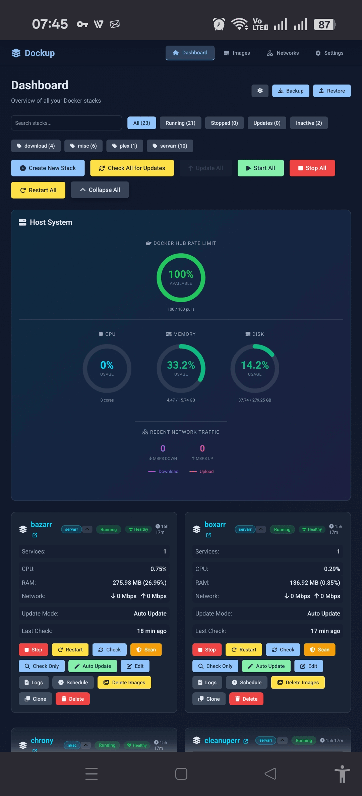

# 🚀 DockUp — Complete Docker Stack Management

**DockUp** is a self-hosted web interface for managing all your Docker containers and stacks. It combines visual stack management with automatic update detection, health monitoring, vulnerability scanning, and multi-server support—all from one clean dashboard.

Think of it as your Docker control center: manage 30+ stacks across multiple servers, schedule automatic updates like Watchtower, get notified when containers go down, and keep track of security vulnerabilities. All without touching the command line.

<p align="center">
  
</p>

---

## ✨ What DockUp Does

### 🐳 Stack Management

**Auto-Discovery & Import**
- Automatically finds all Docker Compose stacks in your `/stacks` directory
- Imports standalone containers (created with `docker run`) and converts them to compose format
- No manual setup needed—just mount your stacks folder and go

**Visual Stack Editor**
- Edit compose files with a split-view editor that breaks services into organized sections
- Separate tabs for: Basic Info, Environment Variables, Ports, Volumes, Networks, Devices, Security, and Advanced settings
- Full YAML editor available if you prefer raw editing
- Real-time validation catches errors before saving
- Changes are saved directly to your compose files

**Stack Operations**
- **Start/Stop/Restart** stacks with one click
- **Pull** latest images to check for updates
- **Clone** existing stacks to create duplicates
- **Delete** stacks with optional image cleanup
- Watch operations happen live with real-time terminal output
- All settings and schedules survive container restarts

**Smart Features**
- Port conflict detection warns you before starting stacks that would clash
- Automatic web UI detection finds admin panels and creates clickable links
- Badge system shows stack status at a glance (running, stopped, inactive, updates available)
- "Fresh" indicator shows recently updated stacks

### 📋 Template Library

**One-Click App Deployment**
- Browse 300+ pre-configured LinuxServer.io application templates
- Each template includes optimized Docker Compose configuration
- Enhanced with real-time Docker Hub metadata:
  - Pull counts and star ratings
  - Available image tags
  - Last update timestamps
  - Image sizes
- Searchable by name, category, or description
- Categories include: Media, Home Automation, Development, Networking, Security, and more

**Smart Template System**
- Automatically scrapes LinuxServer.io documentation for default configurations
- Generates compose files with recommended environment variables
- Pre-configured volume mounts and port mappings
- Health checks included where applicable
- Direct links to official documentation and GitHub repos

**How to Use Templates**
1. Click "Create from Template" in dashboard
2. Search or browse by category
3. Click any template to preview its compose file
4. Customize stack name and settings
5. Deploy instantly—stack appears in dashboard
6. Template library refreshes automatically to stay current

### 🕐 Action Scheduling

**Schedule Stack Actions**
- Schedule stacks to start, stop, or restart at specific times
- Each stack supports multiple schedules (e.g., start at 8 AM, stop at 6 PM)
- Uses cron expressions for flexible timing
- Independent from update schedules—manage separately

**Common Use Cases**
- **Daily Restarts**: Restart resource-hungry apps nightly (`0 3 * * *`)
- **Business Hours**: Start stacks at 8 AM, stop at 6 PM weekdays
- **Weekend Shutdowns**: Stop dev environments Friday evening, restart Monday morning
- **Periodic Refreshes**: Restart every 6 hours to clear memory leaks
- **Maintenance Windows**: Stop before backups, restart after

**Schedule Configuration**
- Add unlimited action schedules per stack
- Each schedule has:
  - Action type (start, stop, restart)
  - Cron expression for timing
  - Optional description/label
- Schedules run in your configured timezone
- View upcoming scheduled actions
- Enable/disable schedules without deleting them

**Example Schedules**
```
# Start at 8 AM on weekdays
0 8 * * 1-5  (start)

# Stop at 6 PM on weekdays  
0 18 * * 1-5 (stop)

# Restart every night at 3 AM
0 3 * * *    (restart)

# Restart every 6 hours
0 */6 * * *  (restart)
```

### 🌐 Multi-Server Management (Peer Mode)

**Connect Multiple Servers**
- Link multiple DockUp installations together into one unified dashboard
- See stacks from all your servers in a single view
- No master/slave setup—all servers are equal peers
- Secure API token authentication between instances

**What You Can Do Remotely**
- Start, stop, and restart stacks on any connected server
- Monitor CPU, RAM, and network usage across all machines
- Check health status from your entire infrastructure
- View which stacks are running where with server badges

**What Stays Local**
- Editing compose files (edit directly on each server)
- Viewing container logs (view on the server running them)
- Configuring update schedules (each server manages its own)
- Creating or deleting stacks (create on target server)

**Setup is Simple**
1. Install DockUp on each server
2. Give each instance a friendly name (like "Main Server" or "Media Server")
3. Copy the API token from the server you want to connect to
4. Add it as a peer connection with the server's URL
5. Test the connection—you're done

### 📊 Monitoring & Statistics

**Real-Time System Stats**
- Host-level monitoring: CPU usage, RAM usage, disk space, network traffic
- Per-stack statistics: See how much resources each stack consumes
- Per-container breakdowns: CPU, memory, and network for individual containers
- Configurable polling intervals to balance freshness vs system load

**Polling Control**
DockUp gives you three independent polling settings:
- **Host Stats Polling**: How often to refresh CPU/RAM/Disk/Network gauges (1 second to 5 minutes, or off)
- **Stack Refresh Polling**: How often to update container status and running state (1 second to 1 hour, or off)
- **Health Check Polling**: How often to check container health and send alerts (30 seconds to 1 hour, or off)

Set aggressive polling for real-time monitoring, or slow it way down to minimize CPU usage. Health checks run independently so you can have slow UI updates but fast failure detection.

**Container Health Monitoring**
- Tracks which containers have health checks defined
- Monitors health status continuously (healthy, unhealthy, starting)
- Counts consecutive failures before alerting
- Sends notifications when stacks become unhealthy
- Notifies again when stacks recover
- Configurable failure threshold (default: 3 failures)

**Container Logs**
- View real-time logs for any container
- Last 100 lines shown by default
- Helpful for debugging startup issues or checking status

### 🔄 Automatic Updates (Watchtower-Style)

**How Update Detection Works**
DockUp uses the same reliable method as Watchtower:
1. Records the current image IDs (digests) of your running containers
2. Pulls the latest versions of those images from their registries
3. Compares the new image IDs to the old ones
4. If they're different, an update is available

This method is bulletproof—it works with any Docker registry and always detects real updates.

**Three Update Modes Per Stack**

**Off Mode**
- No automatic checking or updating
- You manually check and update when you want

**Check-Only Mode**
- DockUp checks for updates on your schedule
- Shows "Update Available" badge on the dashboard
- Sends you a notification (if enabled)
- Doesn't change anything automatically
- You click "Update" when ready

**Auto-Update Mode**
- DockUp checks for updates on your schedule
- When found, automatically pulls new images
- Recreates containers with the new versions
- Waits for containers to become healthy
- Verifies containers are running new images
- Sends success notification
- If anything fails, sends error notification and stops

**Scheduling Updates**
- Each stack gets its own schedule using cron expressions
- Default schedule applies to new stacks (typically 2 AM daily)
- Common schedules:
  - `0 2 * * *` = Every day at 2 AM
  - `0 3 * * 0` = Every Sunday at 3 AM
  - `0 4 1 * *` = First of every month at 4 AM
  - `*/30 * * * *` = Every 30 minutes (for testing)
- "Apply to All" button bulk-configures multiple stacks at once
- Timezone-aware scheduling respects your local time

**Manual Updates**
- Click "Check for Updates" button to check right now
- Click "Update" button when available to update immediately
- Watch the terminal output as it happens
- Update history tracks when stacks were last updated and how (manual or automatic)

### 🛡️ Security Scanning with Trivy

**Vulnerability Scanning**
- Built-in integration with Trivy (industry-standard security scanner)
- Scans Docker images for known vulnerabilities (CVEs)
- Shows severity levels: Critical, High, Medium, Low
- Provides CVE IDs and vulnerability descriptions
- Completely optional—only scans when you request it

**How Scanning Works**
1. Click "Scan" button on any stack
2. DockUp downloads Trivy database (first time only)
3. Scans all images used by that stack
4. Shows results grouped by severity
5. Results are saved and shown until next scan

**Scan Results Display**
- Summary shows total vulnerabilities by severity
- Expandable lists for each severity level
- CVE details include descriptions and affected packages
- Results persist across page reloads
- Re-scan anytime to check if fixes are available

### 🖼️ Image Management

**Image Overview**
- Lists all Docker images on your system
- Alphabetically sorted with size information
- Shows which images are in use by containers
- Displays unused images that can be safely deleted
- Storage stats help identify space hogs

**Manual Cleanup**
- Delete individual unused images with one click
- "Prune All Unused Images" removes everything not in use
- Confirmation dialogs prevent accidents
- Shows how much space was freed

**Automatic Pruning**
- Schedule automatic cleanup with cron expressions
- Runs in the background at your specified time
- Notifications when pruning completes (optional)
- Example: `0 3 * * 0` prunes unused images every Sunday at 3 AM

### 🌐 Network Management

**View Networks**
- Lists all Docker networks on your system
- Shows network driver type (bridge, macvlan, ipvlan, host, overlay)
- Displays connected containers for each network
- Subnet and gateway information visible

**Create Custom Networks**
- Bridge networks for standard container communication
- Macvlan networks for giving containers direct IPs on your LAN
- Ipvlan networks for IP-level isolation
- Full IPAM configuration: subnets, gateways, IP ranges
- IPv4 and IPv6 support

**Delete Networks**
- Remove unused networks safely
- Warns if network is still in use
- One-click deletion for empty networks

### 🔔 Notifications

**Notification Services**
DockUp supports two ways to send alerts:

**Gotify** (Simple, Self-Hosted)
- Enter your Gotify server URL
- Paste your application token
- Test button verifies connection
- Notifications appear in your Gotify app

**Apprise** (80+ Services)
- Supports Discord, Slack, Telegram, email, Pushover, and 75+ more
- Add service URLs in Apprise format
- Multiple services can be added
- Test button sends to all configured services

**What Gets Notified**
You control exactly what triggers notifications:
- **Update checks** (Check-Only mode): When updates are detected
- **Completed updates** (Auto mode): When auto-updates finish successfully
- **Errors**: When operations fail (pulls, updates, health checks)
- **Health failures**: When containers become unhealthy (after threshold)
- **Recovery**: When previously unhealthy stacks become healthy again
- **Scheduled actions**: When scheduled start/stop/restart actions complete

**Health Alert Threshold**
- Set how many consecutive health check failures before alerting
- Default: 3 failures
- Prevents notification spam from brief glitches
- Once threshold is reached, you get ONE notification
- Another notification when stack recovers

### 💾 Backup & Restore

**One-Click Backup**
- Downloads a ZIP file containing all your compose files
- Includes all stack metadata and settings
- Preserves update schedules and configurations
- Backup includes only stacks on the current server (not remote peers)

**Restore from Backup**
- Upload a previously downloaded backup ZIP
- DockUp extracts all compose files to your stacks directory
- Restores all schedules and metadata
- Stacks appear immediately in the dashboard
- Can restore to a different DockUp instance

**What's Included in Backups**
- All `compose.yaml` / `docker-compose.yml` files
- Stack metadata (`.dockup-meta.json` files)
- Update schedules
- Action schedules
- Stack-specific settings
- Health check history

**What's NOT Included**
- Container volumes (data inside containers)
- Docker images
- Global DockUp settings
- Notification configurations
- Peer connections

### 🔒 Password Protection

**Completely Optional**
- DockUp works without a password by default
- Enable authentication with a toggle switch
- Disable anytime—no forced security

**First-Time Setup**
1. Enable "Password Protection" in settings
2. Save settings
3. You're redirected to create a password
4. Enter password twice to confirm
5. Automatically logged in
6. Password is encrypted and stored securely

**Password Management**
- Change password anytime from settings
- Sessions last 31 days (persistent across browser restarts)
- bcrypt hashing (industry-standard security)
- No password recovery—if forgotten, you'll need container access to reset

**API Token Security**
- Each DockUp instance has a unique API token
- Used for peer-to-peer authentication between servers
- Can be regenerated if compromised
- Separate from password protection
- Shown only when explicitly revealed (hidden by default)

### ⚙️ Advanced Features

**Resource Limits** (Compose Editor)
- Set CPU limits for services (e.g., max 2 CPU cores)
- Set memory limits for services (e.g., max 2GB RAM)
- Prevents runaway containers from consuming all resources
- Applied via Docker Compose `deploy.resources.limits`

**Port Conflict Detection**
- Warns before starting stacks with conflicting port mappings
- Shows which other stack is already using a port
- Prevents failed starts due to port collisions

**Timezone Configuration**
- Set your local timezone in settings
- All scheduled tasks respect your timezone
- Cron schedules run at your local time, not UTC
- Timestamps in UI show in your timezone

**Web UI Auto-Detection**
- DockUp scans container ports and common paths
- Automatically creates clickable links to web interfaces
- Works with most common applications (Plex, Sonarr, etc.)
- Saves you from memorizing port numbers

**WebSocket Live Updates**
- Real-time terminal output during operations
- Dashboard updates automatically when changes occur
- No page refresh needed to see status changes
- Minimal overhead—only sends updates when needed

**Offline Capability**
- Works without internet once images are pulled
- Local registries fully supported
- Update detection works with air-gapped registries
- Only outbound connection is for pulling images

**Dark Theme**
- Beautiful dark interface optimized for homelabs
- Easy on the eyes during late-night troubleshooting
- Professional appearance
- Theme preference saved per browser

---

## 🚀 Installation

### Quick Start with Docker Run

```bash
docker run -d \
  --name dockup \
  -p 5000:5000 \
  -v /var/run/docker.sock:/var/run/docker.sock \
  -v /path/to/your/stacks:/stacks \
  -v /DATA/AppData:/DATA/AppData:ro \
  -v dockup_data:/app/data \
  --restart unless-stopped \
  cbothma/dockup:latest
```

**Optional PORT environment variable:**
```bash
docker run -d \
  --name dockup \
  -e PORT=80 \
  -p 80:80 \
  -v /var/run/docker.sock:/var/run/docker.sock \
  -v /path/to/your/stacks:/stacks \
  -v dockup_data:/app/data \
  --restart unless-stopped \
  cbothma/dockup:latest
```

### Docker Compose

```yaml
version: '3.8'
services:
  dockup:
    image: cbothma/dockup:latest
    container_name: dockup
    ports:
      - "5000:5000"
    volumes:
      - /var/run/docker.sock:/var/run/docker.sock
      - /path/to/your/stacks:/stacks
      - dockup_data:/app/data
    restart: unless-stopped

volumes:
  dockup_data:
```

### What Each Mount Does

| Volume | Purpose | Required |
|--------|---------|----------|
| `/var/run/docker.sock` | Docker API access—lets DockUp control containers | **Yes** |
| `/stacks` | Your compose files directory—where your stacks live | **Yes** |
| `/app/data` | Settings, schedules, metadata, tokens—everything DockUp remembers | **Yes** |

**Important Notes:**
- The `/stacks` directory is where DockUp looks for compose files
- Each subdirectory in `/stacks` becomes one stack
- Each subdirectory needs a `compose.yaml` (or `docker-compose.yml`) file
- The `/app/data` volume must persist—losing it means losing all your settings
- The `PORT` environment variable allows running DockUp on any port (default: 5000)

---

## 🎯 Getting Started

### First Login

1. Open browser to `http://localhost:5000` (or your server's IP)
2. Dashboard loads immediately—no password required by default
3. If you want password protection, go to Settings and enable it
4. Otherwise, you're ready to go

### Your First Stack

**Method 1: Create from Template**
1. Click "Create from Template" button
2. Browse or search the template library
3. Click any template to see details and preview compose file
4. Click "Use Template" button
5. Customize stack name if desired
6. Stack is created and appears in dashboard
7. Click "Start" to launch the application

**Method 2: Create New Stack**
1. Click "Create Stack" button
2. Enter a stack name (lowercase, no spaces)
3. Choose "Split Editor" or "YAML Editor"
4. Add your services, ports, volumes
5. Save—stack appears in dashboard

**Method 3: Import Existing**
1. Copy your compose files into the `/stacks` directory
2. Create one folder per stack
3. Put `compose.yaml` inside each folder
4. Refresh DockUp—stacks appear automatically

**Method 4: Import Running Containers**
- DockUp automatically detects standalone containers (created with `docker run`)
- They appear in the dashboard with an "Import" button
- Click Import to convert them to compose format
- Original containers keep running—nothing is disrupted

### Managing Your Stacks

**Starting and Stopping**
- Green "Start" button starts all services in a stack
- Red "Stop" button stops and removes containers (data in volumes is safe)
- Yellow "Restart" button restarts all containers in the stack
- Blue "Pull" button downloads latest images without restarting

**Checking for Updates**
1. Click "Check for Updates" button on any stack
2. DockUp pulls latest images and compares them
3. If updates found, orange "Update" button appears
4. Click "Update" to pull images and recreate containers
5. Watch progress in the real-time terminal window

**Setting Up Auto-Updates**
1. Click the schedule icon next to any stack
2. Choose a mode:
   - **Check Only**: Get notified, update manually
   - **Auto Update**: Automatic pull and restart
3. Set schedule (or use default 2 AM daily)
4. Save—DockUp handles updates from now on

**Scheduling Actions (Start/Stop/Restart)**
1. Click the schedule icon next to any stack
2. Go to "Action Schedules" tab
3. Click "Add Schedule"
4. Choose action type: Start, Stop, or Restart
5. Enter cron expression (e.g., `0 8 * * 1-5` for 8 AM weekdays)
6. Add optional description
7. Save—action runs automatically on schedule

**Common Action Schedule Examples:**
- Start at 8 AM weekdays: `0 8 * * 1-5` (start)
- Stop at 6 PM weekdays: `0 18 * * 1-5` (stop)
- Restart every night: `0 3 * * *` (restart)
- Restart every 6 hours: `0 */6 * * *` (restart)

**Editing Compose Files**
1. Click "Edit" button on any stack
2. Split Editor shows organized sections, or use YAML Editor for raw editing
3. Make your changes
4. Click "Save"
5. Changes written immediately to compose file
6. Restart stack to apply changes

### Configuring Notifications

**Gotify Setup:**
1. Settings → Notifications
2. Enter Gotify URL: `http://your-gotify:8080`
3. Enter Application Token (create in Gotify first)
4. Click "Test Gotify"—you should get a notification
5. Enable the alert types you want
6. Save Settings

**Apprise Setup (Discord Example):**
1. Create Discord webhook in your server settings
2. Copy webhook URL
3. In DockUp Settings → Notifications
4. Click "Add Apprise URL"
5. Paste: `discord://webhook_id/webhook_token`
6. Click "Test Apprise"—message appears in Discord
7. Save Settings

### Setting Up Multi-Server (Peer Mode)

**On Server 1 (e.g., Main Server):**
1. Settings → Remote DockUp Instances
2. Set Instance Name: "Main Server"
3. Copy the API Token (click eye icon, then copy)

**On Server 2 (e.g., Media Server):**
1. Install DockUp same way as Server 1
2. Settings → Remote DockUp Instances
3. Set Instance Name: "Media Server"
4. In "Connected Peers" section, click "Add Remote Instance"
5. Fill in:
   - Instance ID: `main-server`
   - Display Name: `Main Server`
   - URL: `http://192.168.1.100:5000`
   - API Token: (paste from Server 1)
6. Click "Add Peer"
7. Click "Test"—should connect successfully
8. Return to Dashboard—you'll now see stacks from both servers

### Backing Up Your Setup

1. Settings → scroll to Backup section
2. Click "Backup All Stacks"
3. Downloads a ZIP file with everything
4. Store it somewhere safe
5. To restore: click "Restore from Backup" and select the ZIP

### Understanding the Dashboard

**Stack Cards Show:**
- Stack name and running status
- Server badge (if from a peer)
- Container count and health status
- CPU, RAM, and network usage
- Update available badge (orange)
- Fresh badge (green, if updated in last 24 hours)
- Action buttons (Start/Stop/Restart/Edit/etc.)

**Color Meanings:**
- **Green**: Running and healthy
- **Red**: Stopped or has stopped containers
- **Yellow**: Some containers stopped (partial)
- **Gray**: Never started (inactive)
- **Orange**: Update available

**Collapsible Sections:**
- Click stack card to expand/collapse details
- Shows individual containers with their stats
- Container-level health indicators
- Quick access to container logs

---

## ⚙️ Configuration Guide

All settings are managed through the web interface. Everything you configure is stored persistently and survives container restarts.

### Polling Intervals

Control how often DockUp checks various things:

**Host Stats Polling**
- How often to refresh CPU/RAM/Disk/Network gauges
- Options: Off, 1s, 5s, 15s, 30s, 60s, 5min
- High frequency = smoother graphs, more CPU usage
- Low frequency = less smooth, lower CPU usage
- Recommended: 30 seconds for normal use

**Stack Refresh Polling**
- How often to update container status and running state
- Options: Off, 1s, 5s, 15s, 30s, 1min, 5min, 10min, 30min, 1 hour
- Affects how quickly dashboard shows state changes
- Set higher (10-30 min) if you have many stacks to reduce overhead
- Recommended: 1 minute for active monitoring, 10+ minutes for large deployments

**Health Check Polling**
- How often to check container health and trigger alerts
- Options: Off, 30s, 1min, 2min, 5min, 10min, 15min, 30min, 1 hour
- Runs independently of other polling
- Fast health checks mean faster failure detection
- Slower checks mean less system overhead
- Recommended: 5 minutes (good balance of speed and efficiency)

### Notification Settings

**Service Configuration**
- Gotify URL and Token for Gotify notifications
- Apprise URLs for everything else (Discord, Slack, email, etc.)
- Test buttons verify connectivity

**Alert Toggles**
- Notify on update checks (Check-Only mode)
- Notify on completed updates (Auto mode)
- Notify on errors (failed operations)
- Notify on health failures (after threshold reached)
- Notify on scheduled actions (when start/stop/restart completes)

**Health Check Threshold**
- How many consecutive failures before sending alert
- Default: 3
- Range: 1-10
- Lower = more sensitive, more notifications
- Higher = fewer false alarms, slower detection

### Timezone

- Set your local timezone for accurate scheduling
- All cron schedules run in this timezone
- All timestamps display in this timezone
- Dropdown shows all standard timezones

### Auto-Prune Images

- Enable automatic cleanup of unused Docker images
- Set schedule with cron expression
- Example: `0 3 * * 0` = Every Sunday at 3 AM
- Frees disk space automatically
- Notification sent when pruning completes (optional)

### Password Protection

- Toggle to enable/disable authentication
- When enabled, redirects to password setup if not set
- When disabled, anyone can access (default)
- Change password button when enabled
- No password recovery—container access required to reset

### Remote DockUp Instances (Peer Mode)

**This Instance Section:**
- Set Instance Name (how this server identifies itself)
- View and copy API Token
- Regenerate token if compromised

**Connected Peers Section:**
- Add new peer connections
- Test existing connections
- Edit peer URLs or tokens
- Remove peers
- Enable/disable individual peers

### Template Library Settings

**Enable/Disable Templates**
- Toggle template library on/off
- When disabled, "Create from Template" button hidden
- Existing stacks unaffected

**Refresh Templates**
- Manual refresh button to update template library
- Fetches latest LinuxServer.io templates
- Updates Docker Hub metadata (pulls, stars, descriptions)
- Re-scrapes documentation for current configs
- Cache refreshes automatically every 7 days

---

## 🔧 How It Works

### Update Detection Process

DockUp uses the Watchtower method because it's the most reliable:

1. **Record Current State**: Reads image ID (digest) from each running container
2. **Pull Latest**: Pulls latest version of each image from its registry
3. **Compare IDs**: Checks if new image ID differs from old ID
4. **Report**: If different, update is available

This works with:
- DockerHub
- GitHub Container Registry (ghcr.io)
- Linux Server Container Registry (lscr.io)
- Quay.io
- Google Container Registry
- Private registries
- Local registries
- Any Docker Registry v2 compatible registry

### Auto-Update Process (Auto Mode)

When scheduled time arrives and update is detected:

1. **Pull Images**: Downloads latest versions of all images in stack
2. **Compare**: Verifies new images are actually different
3. **Stop Containers**: Gracefully stops current containers
4. **Create New**: Starts new containers with updated images
5. **Wait**: Allows time for startup (10 seconds)
6. **Verify Health**: Checks container health status
7. **Confirm**: Verifies new image IDs match pulled versions
8. **Notify**: Sends success or failure notification

If any step fails, the process stops and an error notification is sent.

### Action Scheduling Process

When a scheduled action (start/stop/restart) is triggered:

1. **Execute Action**: Runs the scheduled operation (start, stop, or restart)
2. **Verify Status**: Checks that the operation completed successfully
3. **Notify**: Sends notification if enabled (success or failure)
4. **Log History**: Records the scheduled action in stack history

Multiple schedules can exist for the same stack, allowing complex automation patterns like:
- Start stack every weekday morning
- Stop stack every weekday evening
- Restart stack nightly for memory cleanup

### Health Monitoring

DockUp checks container health by:

1. Reading container's health status from Docker API
2. Health status can be: healthy, unhealthy, starting, or none (no health check)
3. Tracking consecutive failures per stack
4. Comparing against configured threshold (default: 3)
5. Sending notification once threshold reached
6. Resetting counter when stack becomes healthy
7. Sending recovery notification when previously failed stack recovers

Containers without health checks defined show "none" status and don't trigger alerts.

### Template System

The template library works by:

1. **Fetching Templates**: Pulls LinuxServer.io repository list from GitHub API
2. **Docker Hub Integration**: Fetches metadata for each image (pulls, stars, tags, size)
3. **Documentation Scraping**: Scrapes LinuxServer.io docs for recommended configurations
4. **Compose Generation**: Creates optimized compose files with:
   - Recommended environment variables from docs
   - Pre-configured volume mounts
   - Correct port mappings
   - Health checks where applicable
5. **Caching**: Stores templates locally to reduce API calls
6. **Auto-Refresh**: Updates cache every 7 days or on manual refresh

### Peer Communication

When you connect DockUp instances as peers:

1. **Authentication**: Each request includes API token in header
2. **Session Caching**: Successful auth cached to reduce overhead
3. **Stack List**: Primary instance requests `/api/stacks/all` from peer
4. **Status Sync**: Peer returns full stack list with current status
5. **Operations**: Primary proxies operations to peer via `/api/peer/{id}/stack/{name}/operation`
6. **Read-Only**: Destructive operations (edit, delete) disabled for remote stacks

Each instance remains independent—peer connections only provide read/control access, not synchronization.

### Data Persistence

DockUp stores all configuration in the `/app/data` volume:

- **Settings**: Timezone, notification configs, polling intervals
- **Schedules**: Per-stack update schedules and modes
- **Action Schedules**: Per-stack start/stop/restart schedules
- **Update Status**: Last check time, update available flags
- **Update History**: When stacks were updated and by whom
- **Health Status**: Consecutive failure counts, last notification time
- **Peer Connections**: Remote instance URLs and tokens
- **Passwords**: Encrypted password hashes (if enabled)
- **API Token**: This instance's authentication token
- **Scan Results**: Trivy vulnerability scan data
- **Template Cache**: LinuxServer.io templates and metadata

If the `/app/data` volume is lost, all settings reset to defaults but your compose files (in `/stacks`) are unaffected.

### Orphan Container Import

When DockUp finds containers not managed by any compose file:

1. Reads container's labels, environment variables, ports, volumes
2. Generates equivalent compose YAML
3. Creates new stack directory in `/stacks`
4. Writes `compose.yaml` with container's configuration
5. Adds metadata file
6. Original container keeps running—nothing is modified

You can then manage the container through DockUp like any other stack.

---

## 🛠️ Troubleshooting

### DockUp Won't Start

**Check Docker Socket**
```bash
ls -l /var/run/docker.sock
```
Must be readable by container. If not, check volume mount.

**Check Logs**
```bash
docker logs dockup
```
Look for startup errors or permission issues.

### Auto-Updates Not Running

**Verify Schedule Configuration**
- Open stack schedule settings
- Ensure mode is "Check" or "Auto" (not "Off")
- Verify cron expression is valid
- Check timezone setting matches your location

**Check Logs for Scheduler**
```bash
docker logs dockup | grep -i "scheduled\|update check"
```
Should see: `Scheduled update check for <stack>: 0 2 * * *`

**Test with Frequent Schedule**
- Set cron to `*/2 * * * *` (every 2 minutes)
- Watch logs for execution
- Change back to normal schedule after testing

### Action Schedules Not Running

**Verify Action Schedule Configuration**
- Open stack schedule settings
- Go to "Action Schedules" tab
- Ensure schedules are present and have valid cron expressions
- Check timezone setting

**Check Logs for Scheduled Actions**
```bash
docker logs dockup | grep -i "schedule.*action\|scheduled.*start\|scheduled.*stop\|scheduled.*restart"
```
Should see: `[Schedule] Running start for <stack>`

### Notifications Not Arriving

**Test Connection**
- Settings → Notifications
- Click "Test Gotify" or "Test Apprise"
- Check for error messages

**Verify Service URLs**
- Gotify: Check URL format and token
- Apprise: Verify service URL format
- Ensure services are reachable from DockUp container

**Check Alert Toggles**
- Ensure relevant notification types are enabled
- Remember: health alerts only trigger after threshold failures

### High CPU Usage

**Check Polling Intervals**
- Settings → Polling Intervals
- Reduce Host Stats Polling (try 30 seconds)
- Reduce Stack Refresh Polling (try 10 minutes)
- Health Check Polling can be 5-10 minutes

**Check Container Count**
- More containers = more overhead
- Each container is polled individually
- Consider grouping services into fewer stacks

**Check Logs for Errors**
```bash
docker logs dockup | tail -100
```
Look for repeated error messages that might cause retry loops.

### Peer Connection Fails

**Test Connectivity**
```bash
curl http://peer-server:5000/api/peer/test
```
Should return JSON response.

**Verify API Token**
- Copy token again from peer's settings
- Ensure no extra spaces or truncation
- Paste carefully when adding peer

**Check Firewall**
- Ensure port 5000 (or your port) is open
- Check both server and network firewalls
- Try from DockUp container: `docker exec -it dockup curl http://peer:5000`

### Stack Won't Start

**Check Port Conflicts**
- DockUp shows port conflict warnings
- Another container or service might be using the port
- Change port in compose file or stop conflicting service

**Check Logs**
- Click "Logs" button on stack
- Look for error messages from containers
- Common issues: missing volumes, bad env vars, wrong image tags

**Try Manual Start**
```bash
cd /path/to/stacks/stackname
docker compose up -d
```
Error messages show exact problem.

### Templates Not Loading

**Check Template Library Setting**
- Settings → scroll to Template Library
- Ensure templates are enabled
- Try manual refresh button

**Check Network Access**
- DockUp needs internet to fetch templates
- Verify connection: `docker exec -it dockup curl https://api.github.com`
- Check firewall/proxy settings

**Check Logs**
```bash
docker logs dockup | grep -i template
```
Look for template fetching errors.

### Lost Password

If you forget your password and have container access:

```bash
# Option 1: Disable password protection
docker exec -it dockup python3 -c "
import json
with open('/app/data/config.json', 'r') as f:
    config = json.load(f)
config['password_enabled'] = False
with open('/app/data/config.json', 'w') as f:
    json.dump(config, f, indent=2)
"

# Option 2: Delete password hash
docker exec -it dockup rm /app/data/password.hash

# Then restart DockUp
docker restart dockup
```

### Scan Results Not Showing

**Check Trivy Installation**
```bash
docker exec -it dockup trivy --version
```
Should show Trivy version.

**Check Cache Directory**
```bash
docker exec -it dockup ls -la /app/data/trivy-cache
```
Should exist and be writable.

**Manual Scan Test**
```bash
docker exec -it dockup trivy image --cache-dir /app/data/trivy-cache nginx:latest
```
Should download database and show results.

---

## 📜 License

MIT License — Free to use, modify, and share.

---

## 🙏 Credits

Built with inspiration from:
- **Dockge** — Clean stack management interface
- **Watchtower** — Reliable auto-update methodology
- **Portainer** — Comprehensive Docker management
- **Trivy** — Industry-standard vulnerability scanning
- **LinuxServer.io** — Excellent container templates and documentation
- Created with the assistance of AI. 

DockUp aims to be lightweight, focused, and genuinely useful for homelabs and small deployments.

---

**Simple. Powerful. Multi-Server. Just Works.** 🚀